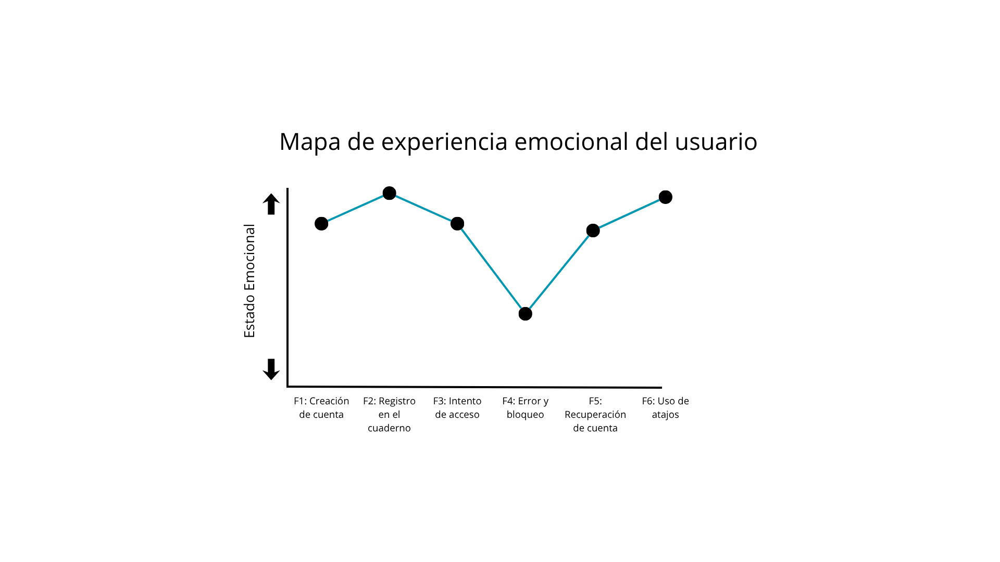

# Mapa de Recorrido del Usuario — Douglas Morales

Este mapa describe la experiencia actual de Douglas al gestionar sus contraseñas e intentar acceder de forma segura a sus cuentas en su día a día, identificando el "valle emocional" más profundo donde reside el problema principal a resolver.

## Fases del Recorrido

| Elemento | F1: Creación de Cuenta | F2: Registro en Cuaderno | F3: Intento de Acceso | F4: Error y Bloqueo (El Valle) | F5: Recuperación de Cuenta | F6: Uso de Atajos |
| :--- | :--- | :--- | :--- | :--- | :--- | :--- |
| **Acciones** | Intenta crear variaciones de sus contraseñas para no repetir. | Escribe la nueva contraseña a mano en su libreta física. | Intenta recordar e ingresar la contraseña en el sitio o app. | Introduce una contraseña incorrecta y el sitio arroja un error genérico. | Inicia el proceso de restablecimiento usando su correo único. | Usa "Continuar con Google" o activa la verificación en dos pasos (2FA) pero se queja porque toma mucho tiempo. |
| **Pensamientos** | *"Tengo que variarla para que sea seguro, pero ¿cómo me voy a acordar después?"* | *"Tengo que anotarla rápido aquí porque si no, se me va a olvidar por completo."* | *"¿Cuál de todas mis contraseñas habré usado para esta plataforma en específico?"* | *"¿Por qué solo dice 'error'? ¿Qué puse mal? ¿Escribí mal el usuario o la contraseña?"* | *"Mejor entro con Google y me ahorro crear otra cuenta. El 2FA es muy tardado."* |
| **Emoción** | Neutral / Preocupado | Aliviado pero con duda | Ansioso / Confundido | **Estresado / Frustrado (Punto más bajo)** | Resignado / Presionado | Pragmático |
| **Puntos de dolor** | Confusión mental al intentar generar contraseñas distintas sin ayuda. | Miedo constante a perder el cuaderno físico o a que alguien lo encuentre. | No saber con certeza cuál contraseña corresponde a cada plataforma. | **Mensajes de error genéricos y falta de feedback. Estrés extremo al intentar acceder con prisa.** | Dependencia de un único correo de recuperación (punto crítico de falla). | Percepción de que la seguridad (2FA) es un obstáculo que quita tiempo. |
| **Oportunidades** | Sugerir y autocompletar contraseñas fuertes de manera transparente. | Digitalizar y proteger las contraseñas sin necesidad de transcripción manual. | Centralizar los accesos de forma intuitiva sin curvas de aprendizaje técnicas. | **Mostrar mensajes de error claros, detallados y guías accionables para evitar bloqueos.** | Diversificar métodos de recuperación seguros y sin fricción. | Integrar biometría o accesos rápidos seguros para eliminar la resistencia al 2FA. |

## Visualización de la Curva Emocional

---

## El Valle Emocional (Tu Problema)

* **Fase del fondo del valle:** **F4: Error y Bloqueo**
* **Justificación:** El ánimo de Douglas cae a su punto más bajo (estrés y frustración severa) cuando se enfrenta a un flujo de inicio de sesión que falla y el sistema no le da ninguna pista de por qué. Esto se agrava de manera crítica si se encuentra con prisas, dejándolo en un callejón sin salida sin saber qué corregir antes de que su cuenta sea bloqueada.
* **Evidencia (Cita de Douglas):** > "Me estresa cuando tengo que recuperar el acceso a algo justo cuando ando con prisa."
  > "Lo que más me molesta es cuando un sitio no te dice por qué falló el inicio de sesión, solo dice 'error'."